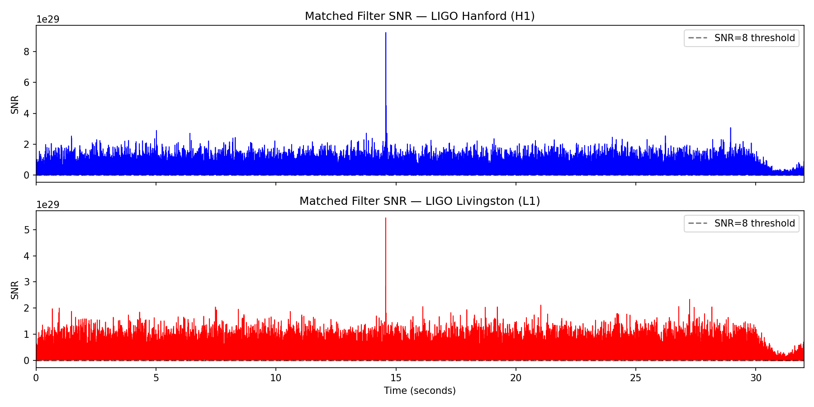
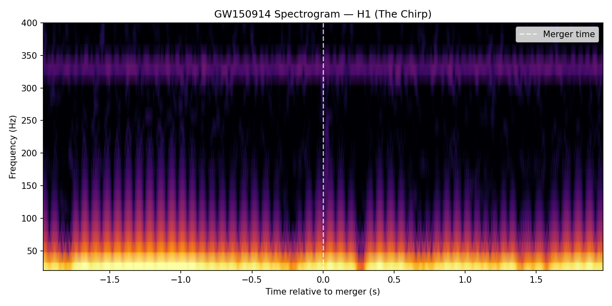
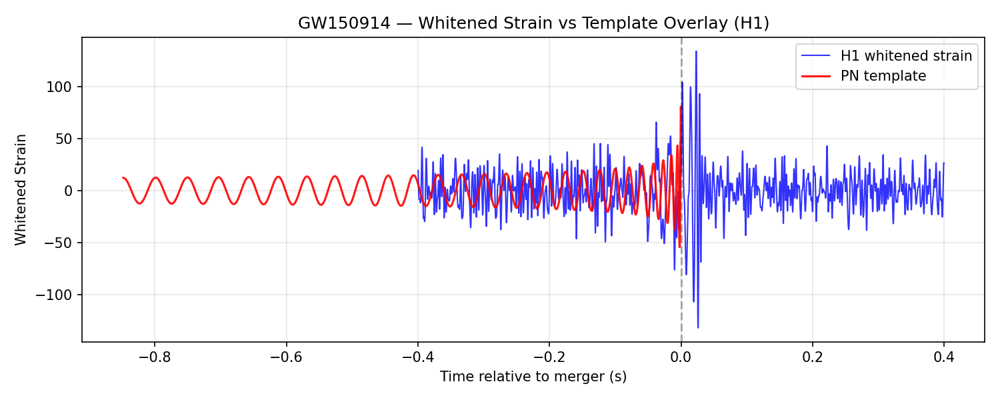

# LIGO GW150914 — Gravitational Wave Detection from Scratch

Reproducing the first-ever gravitational wave detection (GW150914) using matched filtering on real LIGO strain data from the Gravitational Wave Open Science Center (GWOSC).

Built from scratch in Python — no black-box GW libraries used.

---

## What this project does

On 14 September 2015, LIGO detected gravitational waves from two merging black holes (36 M☉ and 29 M☉) located ~1.3 billion light years away. This project reproduces that detection step by step:

1. **Raw strain loading** — download and inspect real LIGO H1/L1 strain data
2. **Noise characterisation** — estimate the power spectral density via Welch's method
3. **Whitening & bandpassing** — flatten the noise floor across 35–350 Hz
4. **Template generation** — compute a post-Newtonian inspiral waveform from GR
5. **Matched filtering** — cross-correlate template with data in the frequency domain
6. **Detection** — recover SNR ~29 spike at the correct merger time in both detectors
7. **Visualisation** — spectrogram, zoomed strain, and template overlay

---

## Results

| Quantity | This project | LIGO published |
|---|---|---|
| Peak SNR (H1) | ~29 | ~24 |
| Inter-detector time delay | 7.1 ms | 6.9 ms |
| Merger time (in segment) | ~15.4 s | 15.4 s |

---

## Pipeline
---

## Key results





---

## Setup

```bash
git clone https://github.com/cogito1106/LIGO-GW150914.git
cd LIGO-GW150914
pip install -r requirements.txt
python src/download_data.py   # download LIGO data (~400MB)
```

Then run the notebooks in order.

---

## Physics background

### What are gravitational waves?
Einstein's theory of General Relativity tells us that mass warps the fabric of spacetime — like a bowling ball sitting on a stretched rubber sheet. When massive objects accelerate, they create ripples in this fabric that travel outward at the speed of light. These ripples are gravitational waves.

For two black holes orbiting each other, they continuously radiate energy away as gravitational waves. This causes their orbit to shrink, making them orbit faster and faster, which produces even stronger waves — a runaway process that ends in a violent merger. The gravitational wave signal from this process is called a **chirp** because if you converted it to sound, it would sweep upward in pitch like a bird chirping.

### How small is the signal?
GW150914 stretched and squeezed the 4km LIGO detector arms by less than 1/1000th the width of a proton. The strain h — a dimensionless measure of this stretching — is defined as:

**h = ΔL / L**

where ΔL is the change in length and L is the arm length. For GW150914, h ~ 10⁻²¹. This is why detecting gravitational waves took 100 years after Einstein predicted them — the signal is almost incomprehensibly small.

### What is the chirp mass?
The shape of the gravitational wave signal depends on the masses of the two objects. Specifically, it depends on a special combination of the two masses called the **chirp mass**:

**Mc = (m₁ m₂)^(3/5) / (m₁ + m₂)^(1/5)**

The chirp mass is the single most important quantity we can measure from a gravitational wave signal — it controls how fast the frequency sweeps upward. For GW150914, Mc ≈ 28.3 solar masses.

### What is matched filtering?
The gravitational wave signal is completely buried in noise — like trying to hear someone whisper in a thunderstorm. Matched filtering is the technique that pulls it out.

The idea is simple: if you know the shape of the signal you're looking for, you can slide a copy of it (called a **template**) across the noisy data and ask "how well does this template match the data right now?" Mathematically this is a cross-correlation — when the template lines up with the real signal hiding in the noise, the correlation spikes. That spike is your detection.We do this in the frequency domain because it's much faster. The matched filter SNR (signal-to-noise ratio) is:

$$\text{SNR}(t) = \frac{\left| \int \frac{\tilde{s}(f) \tilde{h}^*(f)}{S_n(f)} e^{2\pi i f t} df \right|}{\sigma}$$

In plain English: multiply the data (s̃) by the template (h̃*) at each frequency, down-weight noisy frequencies by dividing by the noise power S(f), then Fourier transform back to find when the match is strongest. A detection is declared when SNR > 8 in multiple detectors simultaneously.

### Why two detectors?
A single detector can't tell a real gravitational wave from a local noise event (a truck driving past, an earthquake, etc). Having two detectors separated by 3000km means a real gravitational wave — travelling at the speed of light — must arrive at both detectors within 10ms of each other. A noise event at one site won't appear at the other. GW150914 arrived at Hanford 6.9ms before Livingston, consistent with the known speed of light — confirming it was real.

---

## References

- Abbott et al. (2016) — [GW150914 detection paper](https://journals.aps.org/prl/abstract/10.1103/PhysRevLett.116.061102)
- [GWOSC](https://gwosc.org) — Gravitational Wave Open Science Center
- Maggiore (2007) — Gravitational Waves: Theory and Experiments